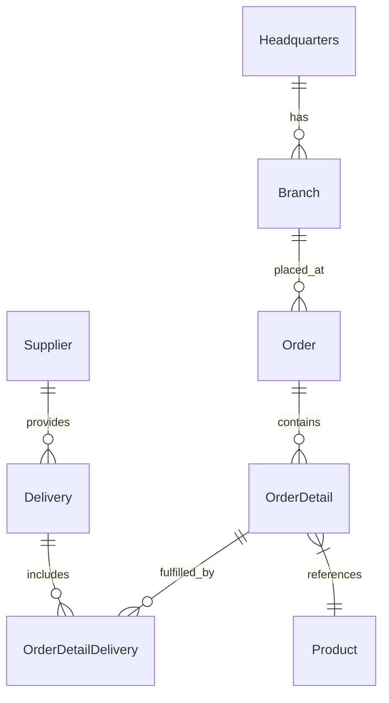

# Project Structure

This document describes the structure of the **OctoCAT Supply Chain Management System** — a monorepo demonstrating GitHub Copilot capabilities with a React frontend and an Express.js backend API.

---

## Repository Layout

```
GitHubCopilot_Customized/
├── .github/                    # GitHub-specific configuration
│   ├── agents/                 # Custom Copilot Chat agents
│   │   └── ImplementationIdeas.agent.md
│   ├── prompts/                # Reusable Copilot prompt files
│   │   ├── plan.prompt.md
│   │   ├── model.prompt.md
│   │   └── Unit-Test-Coverage.prompt.md
│   └── skills/
│       └── frontend-design/
│           └── SKILL.md        # Agent skill for frontend design review
├── .vscode/                    # VS Code workspace settings
│   ├── launch.json             # Debug configurations
│   ├── mcp.json                # MCP server configuration
│   └── tasks.json              # Build/run task definitions
├── api/                        # Backend — Express.js REST API
├── frontend/                   # Frontend — React + Vite application
├── docs/                       # Project documentation
├── infra/                      # Infrastructure scripts
├── package.json                # Root npm workspace configuration
├── package-lock.json
├── README.md
├── SECURITY.md
└── PROJECT_STRUCTURE.md        # This file
```

---

## `api/` — Backend

The backend is a **Node.js / Express.js** REST API written in TypeScript. It exposes CRUD endpoints for every supply chain entity and serves interactive OpenAPI (Swagger) documentation.

```
api/
├── src/
│   ├── index.ts                # Application entry point; registers all routes and Swagger
│   ├── seedData.ts             # In-memory seed data used by all route handlers
│   ├── models/                 # TypeScript interfaces + Swagger schema annotations
│   │   ├── branch.ts
│   │   ├── delivery.ts
│   │   ├── headquarters.ts
│   │   ├── order.ts
│   │   ├── orderDetail.ts
│   │   ├── orderDetailDelivery.ts
│   │   ├── product.ts
│   │   └── supplier.ts
│   └── routes/                 # Express route handlers (one file per entity)
│       ├── branch.ts
│       ├── branch.test.ts      # Vitest integration tests for the branch routes
│       ├── delivery.ts
│       ├── headquarters.ts
│       ├── order.ts
│       ├── orderDetail.ts
│       ├── orderDetailDelivery.ts
│       ├── product.ts
│       └── supplier.ts
├── api-swagger.json            # Exported OpenAPI specification snapshot
├── package.json
├── tsconfig.json
└── vitest.config.ts            # Vitest test runner configuration
```

### API Endpoints

| Endpoint | Resource |
|---|---|
| `GET / POST /api/branches` | Branch offices |
| `GET / POST /api/headquarters` | Headquarters |
| `GET / POST /api/products` | Products |
| `GET / POST /api/suppliers` | Suppliers |
| `GET / POST /api/orders` | Customer orders |
| `GET / POST /api/order-details` | Line items within an order |
| `GET / POST /api/deliveries` | Supplier deliveries |
| `GET / POST /api/order-detail-deliveries` | Delivery fulfilment records |
| `GET /api-docs` | Interactive Swagger UI |
| `GET /api-docs.json` | Raw OpenAPI JSON |

### Backend Tech Stack

| Technology | Purpose |
|---|---|
| Node.js ≥ 18 | Runtime |
| Express.js 4 | HTTP framework |
| TypeScript 5 | Type safety |
| `tsx` | TypeScript execution for development |
| swagger-jsdoc + swagger-ui-express | OpenAPI documentation |
| cors | Cross-Origin Resource Sharing |
| Vitest | Unit / integration testing |
| supertest | HTTP assertion helpers in tests |

---

## `frontend/` — Frontend

The frontend is a **React 18** single-page application built with **Vite** and styled with **Tailwind CSS**.

```
frontend/
├── public/                     # Static assets (images, hero banner, etc.)
├── src/
│   ├── main.tsx                # React entry point — mounts <App />
│   ├── App.tsx                 # Root component; sets up routing, Auth & Theme providers
│   ├── index.css               # Global styles (Tailwind directives)
│   ├── vite-env.d.ts           # Vite environment type declarations
│   ├── api/
│   │   └── config.ts           # API base URL resolution (local, Codespace, runtime config)
│   ├── components/
│   │   ├── About.tsx           # About page
│   │   ├── Footer.tsx          # Site-wide footer
│   │   ├── Login.tsx           # Login form
│   │   ├── Navigation.tsx      # Top navigation bar (includes dark-mode toggle)
│   │   ├── Welcome.tsx         # Landing / home page
│   │   ├── admin/
│   │   │   └── AdminProducts.tsx  # Admin product management page
│   │   └── entity/
│   │       └── product/
│   │           ├── Products.tsx    # Public product listing page
│   │           └── ProductForm.tsx # Add / edit product form
│   └── context/
│       ├── AuthContext.tsx         # Authentication context and provider
│       ├── ThemeContext.tsx        # Dark/light theme context and provider
│       ├── themeContextUtils.tsx   # Theme utility helpers
│       └── useTheme.tsx            # useTheme convenience hook
├── eslint.config.js
├── package.json
├── postcss.config.js
├── tailwind.config.js
├── tsconfig.json
├── tsconfig.app.json
├── tsconfig.node.json
└── vite.config.ts
```

### Frontend Routes

| Path | Component | Description |
|---|---|---|
| `/` | `Welcome` | Landing page |
| `/about` | `About` | About page |
| `/products` | `Products` | Browse products |
| `/login` | `Login` | Sign in |
| `/admin/products` | `AdminProducts` | Manage products (admin) |

### Frontend Tech Stack

| Technology | Purpose |
|---|---|
| React 18 | UI framework |
| TypeScript 5 | Type safety |
| Vite 6 | Build tool & dev server |
| Tailwind CSS 3 | Utility-first styling |
| React Router DOM 7 | Client-side routing |
| Axios | HTTP client |
| react-query | Server state management |
| react-slick | Carousel component |
| Vitest + Testing Library | Unit testing |
| ESLint | Linting |

---

## `docs/` — Documentation

```
docs/
├── architecture.md         # System architecture overview and ERD
├── build.md                # Detailed build instructions
├── demo-script.md          # Step-by-step demo guide
├── deployment.md           # Deployment guide
├── model-comparison.md     # Copilot model comparison notes
├── tao.md                  # Observability / TAO integration notes
├── design/                 # UI design assets and mockups
└── mcp.png                 # MCP server diagram
```

---

## `infra/` — Infrastructure

```
infra/
└── configure-deployment.sh  # Shell script for configuring deployment environment variables
```

---

## `.github/` — GitHub Copilot Customization

```
.github/
├── agents/
│   └── ImplementationIdeas.agent.md   # Custom Chat agent for exploring implementation ideas
├── prompts/
│   ├── plan.prompt.md                 # Prompt for generating feature plans
│   ├── model.prompt.md                # Prompt for model-related tasks
│   └── Unit-Test-Coverage.prompt.md   # Prompt for generating unit test coverage
└── skills/
    └── frontend-design/
        └── SKILL.md                   # Agent skill for frontend design review
```

---

## Root Configuration

| File | Purpose |
|---|---|
| `package.json` | npm workspace root; defines workspace scripts for `api` and `frontend` |
| `package-lock.json` | Lockfile for reproducible installs |
| `README.md` | Project introduction and hands-on scenarios |
| `SECURITY.md` | Security policy |

### Root npm Scripts

| Script | Description |
|---|---|
| `npm run build` | Build both `api` and `frontend` workspaces |
| `npm run dev` | Start API and frontend concurrently (development) |
| `npm run dev:api` | Start only the API in development mode |
| `npm run dev:frontend` | Start only the frontend in development mode |
| `npm run start` | Start the compiled API server |
| `npm run test` | Run tests in all workspaces |
| `npm run test:api` | Run API tests only |
| `npm run test:frontend` | Run frontend tests only |
| `npm run lint` | Lint the frontend workspace |

---

## Data Model (ERD)



---

## Getting Started

```bash
# Install all dependencies (root + workspaces)
npm install

# Build both workspaces
npm run build

# Start API and frontend together
npm run dev
```

- **API** runs on `http://localhost:3000`  
- **Frontend** runs on `http://localhost:5173`  
- **Swagger UI** available at `http://localhost:3000/api-docs`

For VS Code users, use `Ctrl/Cmd + Shift + P` → **Run Task** → **Build All**, or use the Debug panel to launch **Start API & Frontend**.
